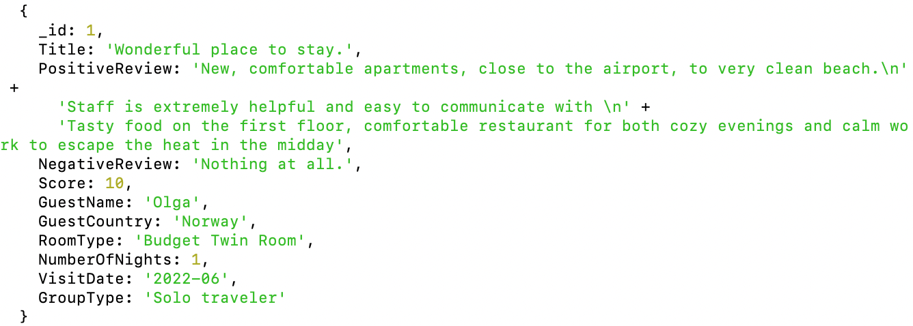

# README
# Emulating Firebases: Hotel Reviews Synchronous Forum

## Table of Contents
- [Introduction](#introduction)
- [Database Description](#database-description)
- [Data Processing Implementation](#data-processing-implementation)
- [Flask Application Implementation](#flask-application-implementation)
- [WebSocket and UI Design Implementation](#webSocket-and-ui-design-implementation)
- [Conclusion](#conclusion)

## Introduction
Data collection and management are critical for businesses of all sizes in today's digital age. The hospitality industry in particular relies heavily on customer reviews to improve service and retain customers. In this project, we utilize a Flask application and a WebSocket server to develop a real-time guest review system for a hotel called the LA Veranda Hotel. The application, in particular, enables RESTful API by entering the curl command to retrieve, search or alter the data conveniently for users and data managers. Moreover, The system allows guests to leave their reviews, and the hotel management to view them in real-time, and take necessary actions. This report will discuss the database description, project implementation, UI design, and learning experiences, and conclude with the outcomes and future work.

Here is the Google Drive Link containing all the source codes:
https://drive.google.com/drive/folders/1vLqcmyXy6ykKPjR6YqGAe5Fl6gtEnkk_?usp=sharing

## Database Description 

The data used in this project is sourced from the Kaggle website and contains customer reviews for a hotel in Larnaca, Cyprus. The dataset is available in the form of a CSV file and consists of 1500 instances and 11 attributes that document every comment, whether positive or negative, about the hotel. The attributes include guest name, guest country, score, title, positive review, negative review, room type, number of nights, visit date, and group type.

## Data Processing Implementation

To make the data usable for our project, we implemented two following python scripts, that first read the CSV input file and output the JSON file with incrementing ID for proper indexing, then load the JSON file into our local host MongoDB server.

- [convert_csv_json.py](./code/convert_csv_json.py): The Python script transforms a CSV file into JSON, cleaning data and formatting dates, while also assigning IDs and removing nulls before saving and confirming success.
- [load.py](./code/load.py): The Python script, using the pymongo library, takes a MongoDB username and a JSON file from the command line, loads the data into a "reviews" collection in the "La_Veranda" database, replacing the collection if it already exists.

The following is an example of a document, id=1.

## Flask Application Implementation

The Flask application provides a web interface for users to query and visualize the hotel reviews data. The application uses the Flask framework and allows users to access various endpoints through a RESTful API.

- [server.py](./code/server.py): The whole RESTful API implementation is accomplished in the Python script, “server.py”. Specifically, we define GET, PUT, PATCH, DELETE, and OrderBy methods under various routes.

## WebSocket and UI Design Implementation

The project develops a Web application that enables the user to interact with the database and synchronize data.

- [websocket-server.py](./code/websocket-server.py): The Python script implements a WebSocket server that interfaces with a Flask server for CRUD operations on MongoDB, listening on multiple ports and routing different request types to their specific functions.

- [webpage.html](./webpage.html): The webpage.html file is a user interface that allows users to view, add, delete, and filter LA Veranda hotel reviews in real-time. The user interface includes a header containing the name of the hotel, a section for displaying reviews, and forms for adding, removing, and filtering reviews.

### UI Design

The webpage.html file facilitates real-time CRUD operations on a server-side application via WebSocket connections, enabling dynamic interaction for users to submit, delete, and filter reviews. It opens a WebSocket to listen for server-sent review data, displaying it using JSON parsing and the forEach method. Users can submit reviews through a detailed form, delete reviews by ID or all at once, and filter reviews based on specified criteria, with each action communicated to the server through WebSocket connections tailored to the HTTP method. This setup provides a seamless and interactive user experience for managing review data in real-time.

## Conclusion

This project demonstrates the development of a real-time guest review system for a hotel using a Flask application and a WebSocket server. The project involved data collection, processing, and management using Python scripts, MongoDB, and the Flask framework. The implemented RESTful API endpoints allowed users to retrieve, search, update, and delete hotel review data conveniently by entering curl commands in the terminal. Additionally, the WebSocket server and HTML webpage provided a user interface for real-time review submission and visualization.

